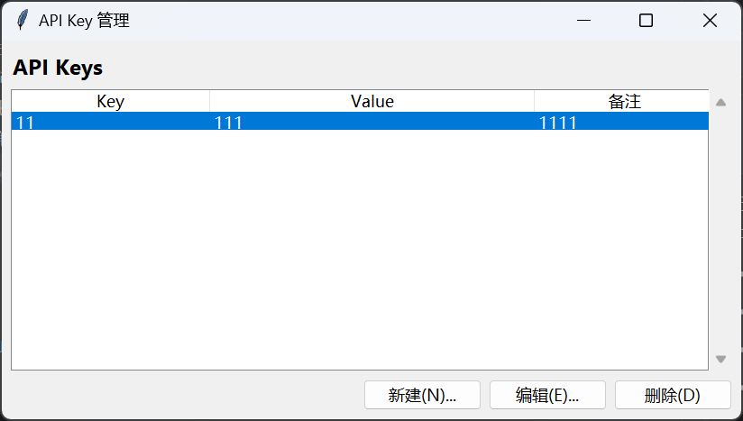

# KeyVault
一个基于 Python 的轻量级桌面应用程序，用于安全、便捷地存储和管理你的 API Key。

## 🌟 主要功能

- **持久化存储**：使用 SQLite 数据库，数据永久保存。
- **三字段设计**：严格遵循 `Key`、`Value`、`备注` 三个字段进行管理。
- **便捷交互**：
  - **双击编辑**：直接双击表格行即可修改。
  - **单击复制**：单击任何单元格自动复制内容到剪贴板，并有弹出提示。
- **系统托盘**：支持最小化到系统托盘，不占任务栏空间，点击托盘图标可快速恢复或退出。
- **自动定位**：主窗口及弹窗均自动居中显示，符合 Windows 操作习惯。

## 🛠️ 环境准备

确保你的电脑已安装 Python 3.8+。

### 安装依赖
打开终端并运行以下命令安装必要的库：

```bash
pip install pystray Pillow
```

## 🚀 启动方式

在项目根目录下运行：

```bash
python main.py
```

- **数据库位置**：首次运行后，数据库文件将自动创建在 `~/.save_api_key/apikeys.db`。

## 📦 打包流程 (生成 .exe)

如果你想将其打包成一个独立的 Windows 软件，请按以下步骤操作：

1. **安装打包工具**：
   ```bash
   pip install pyinstaller
   ```

2. **执行打包命令**：
   ```bash
   pyinstaller --noconsole --onefile --name "APIKeyManager" main.py
   ```

3. **获取软件**：
   打包完成后，在生成的 `dist` 文件夹中可以找到 `APIKeyManager.exe`。你可以将该文件移动到任何位置使用。

## ⌨️ 快捷操作说明

- **Alt + N**：快速打开“新建”弹窗。
- **Alt + E**：编辑当前选中的 API Key。
- **Alt + D**：删除当前选中的 API Key。
- **双击行**：快速进入编辑模式。
- **单击单元格**：内容自动复制，弹出“复制成功”提示。
- **Enter (弹窗内)**：确认并保存。
- **Esc (弹窗内)**：取消并关闭弹窗。
- **关闭窗口**：点击右上角关闭按钮，程序将最小化到托盘。
- **托盘操作**：右键点击托盘中的蓝色羽毛图标，可选择“显示”或“退出”。

--- ps 将快捷方式拖入 shell:startup 目录即可实现自启动
